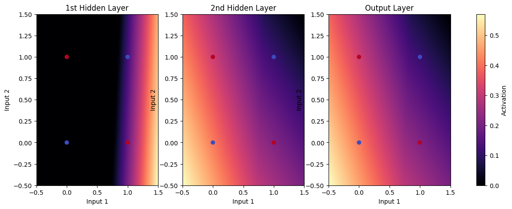
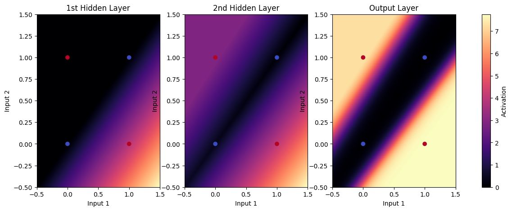

# Multilayer_Perceptron_XOR
This repository implements a simple Multilayer Perceptron (MLP) from scratch using NumPy to solve the XOR classification problem. The network consists of one hidden layer with two neurons (ReLU activation) and an output layer with a sigmoid activation function.

---

### **GitHub Repository Description:**  
🔥 **XOR Classification Using a NumPy-based MLP**  
This repository contains a **fully connected neural network (MLP) built from scratch using NumPy** to solve the classic **XOR classification problem**. The model includes **one hidden layer with two neurons (ReLU activation) and an output layer with sigmoid activation**. Training is performed using **gradient descent with cross-entropy loss**, and the results are visualized through **heatmaps of hidden layer activations and model predictions**.

---

### **README.md**  

# 🔥 XOR Classification Using a NumPy-based MLP  

## 📌 Overview  
This project implements a **Multilayer Perceptron (MLP) from scratch using NumPy** to classify **XOR** inputs, a classic **non-linearly separable problem**.  

Since the **XOR function** cannot be solved using a single-layer perceptron, we implement a **2-layer neural network** with:  
✅ **Hidden Layer (2 neurons, ReLU activation)**  
✅ **Output Layer (1 neuron, Sigmoid activation)**  
✅ **Cross-Entropy Loss for Binary Classification**  
✅ **Gradient Descent for Optimization**  
✅ **Heatmap Visualizations of Activations**  

## 📊 Network Architecture  
| Layer        | Type            | Neurons | Activation |
|-------------|----------------|---------|------------|
| Input Layer | -              | 2       | -          |
| Hidden Layer | Fully Connected | 2       | ReLU       |
| Output Layer | Fully Connected | 1       | Sigmoid    |

## 🏗️ Model Implementation  
- **Forward Pass**  
  - Computes activations for the hidden layer using **ReLU**.  
  - Computes final predictions using **Sigmoid**.  
- **Loss Calculation**  
  - Uses **cross-entropy loss** for binary classification.  
- **Backward Pass (Backpropagation & Gradient Descent)**  
  - Computes gradients using **chain rule** and **updates weights**.  
- **Visualization**  
  - **Every 20 epochs**, heatmaps of hidden layer activations & model output are generated.  


## 🎯 Expected Output  
- **Loss decreases over 200 iterations**.  
- **Final Predictions for XOR Inputs (~Close to 0 or 1):**  
  ```
  Epoch 180
  Loss: 0.01727706658985529
  Predictions: [[0.00670835 0.9351821  0.99790793 0.00318862]]
  ```

  

  

## 🤝 Contributing  
Feel free to open an **issue** or submit a **pull request** if you have improvements or suggestions!  

---

### ✅ **Let me know if you need any modifications! 🚀**
